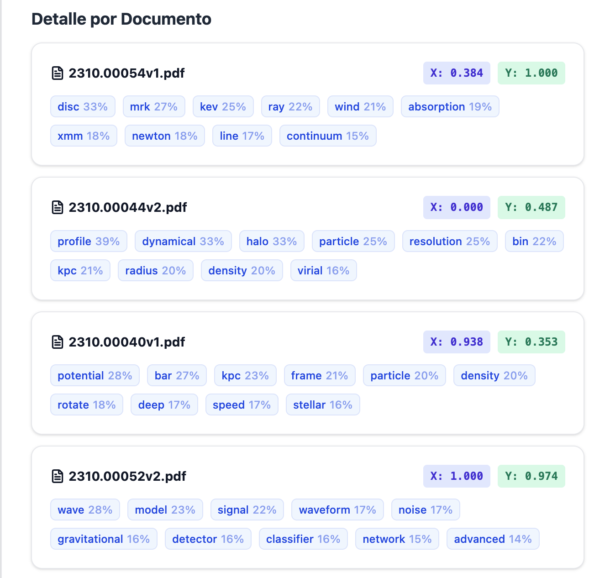
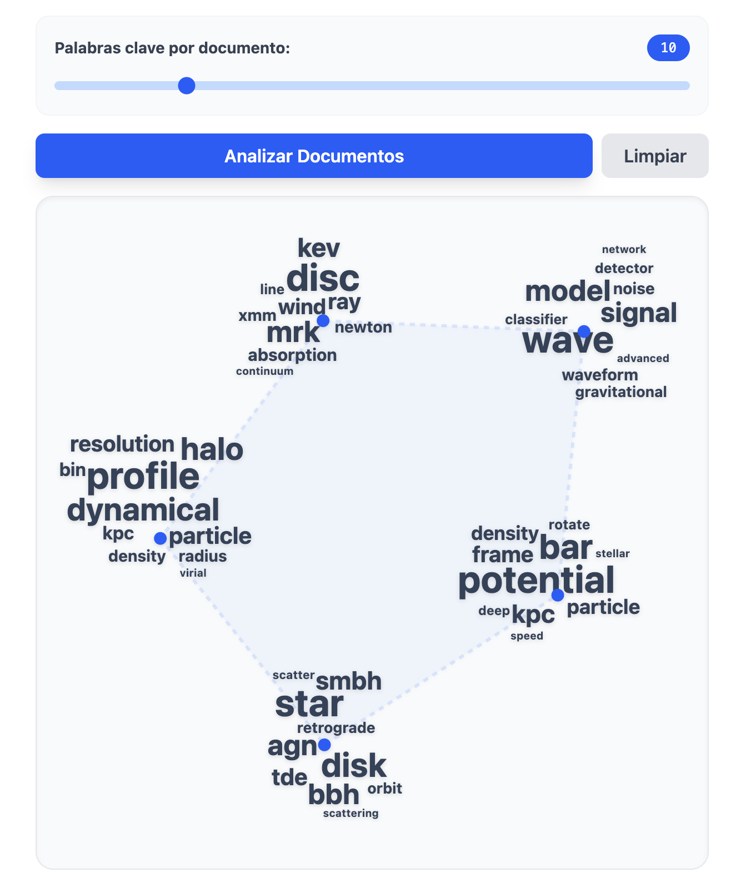

# Graphicloud

El backend está construido en python y se encuentra [en este repositorio](https://github.com/Verborrea/graphicloud-backend).

Para correr el frontend es necesario tener instalado `node` y `pnpm`. Una vez clonado, se instalan las dependencias y se corre de esta forma:

```sh
pnpm install
pnpm run dev
```

De momento es posible subir varios archivos y editar la cantidad de palabras al enviarlos, no es posible editar esta cantidad en tiempo real. Próximamente sí.


Detalles de cada documento.


Múltiples nubes sobre el polígono de documentos
