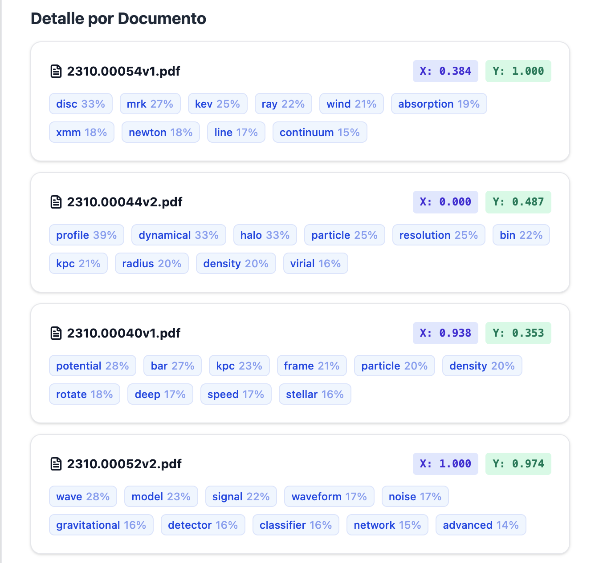
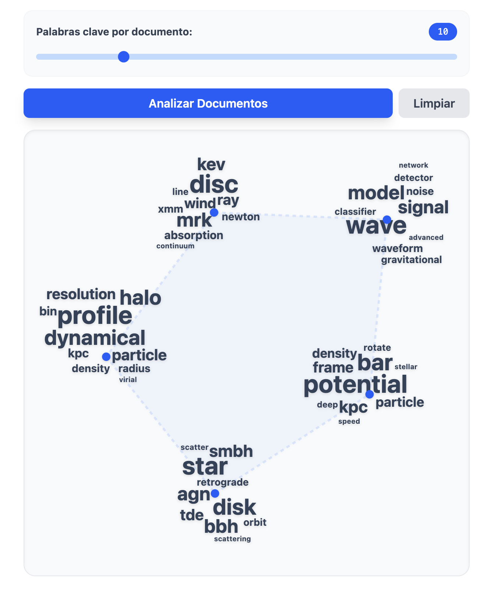

# Graphicloud

El backend está construido en python y se encuentra [en este repositorio](https://github.com/Verborrea/graphicloud-backend).

Para correr el frontend es necesario tener instalado `node` y `pnpm`. Una vez clonado, se instalan las dependencias y se corre de esta forma:

```sh
pnpm install
pnpm run dev
```

De momento es posible subir varios archivos y editar la cantidad de palabras al enviarlos, no es posible editar esta cantidad en tiempo real. Próximamente sí.


Detalles de cada documento.


Múltiples nubes sobre el polígono de documentos

<!-- <script lang="ts">
	import { onMount } from 'svelte';
	import { configState } from '$lib/state.svelte';
	import { measureWord } from '$lib/measureWord';
	import { myWordle } from '$lib/utils';

	const initial = [
		{ id: 1, text: 'Hola mundo', fontSize: 24, score: 100 },
		{ id: 2, text: 'Svelte 5', fontSize: 32, score: 150 },
		{ id: 3, text: 'Canvas API', fontSize: 64, score: 200 },
		{ id: 4, text: 'Visualización', fontSize: 18, score: 50 }
	];

	let nodes = $state<any[]>([]);

	onMount(async () => {
		// 1. Medir todas las palabras primero (Async)
		const measured = await Promise.all(
			initial.map(async (n) => {
				const dimensions = await measureWord(n.text, n.fontSize, configState.font);
				return { ...n, ...dimensions };
			})
		);

		// 2. Calcular posiciones con el algoritmo (Sync)
		const positioned = myWordle(measured, 'mani');

		nodes = positioned.map((n) => ({
			...n,
			x: n.x,
			y: n.y,
			rectX: n.rectX,
			rectY: n.rectY
		}));
	});
</script>

{#each nodes as node (node.id)}
	{#if configState.layers.bb}
		<rect
			x={node.x}
			y={node.y - node.ascent}
			width={node.width}
			height={node.height}
			fill="none"
			stroke="#3b82f6"
			stroke-width="0.5"
		/>
	{/if}

	<text x={node.x} y={node.y} font-size={node.fontSize} font-family={configState.font} fill="#111">
		{node.text}
	</text>
{/each} -->
